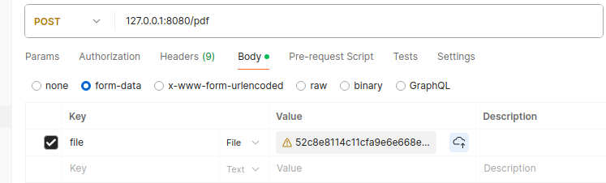

// docker commands 
<code style="color : greenyellow">docker-compose -f ./docker/docker-compose.yml build  </code>
<code style="color : greenyellow">docker-compose -f ./docker/docker-compose.yml up  </code>

// request to port 8080  
<code style="color : lightskyblue">POST 127.0.0.1:8080/pdf  </code> 
